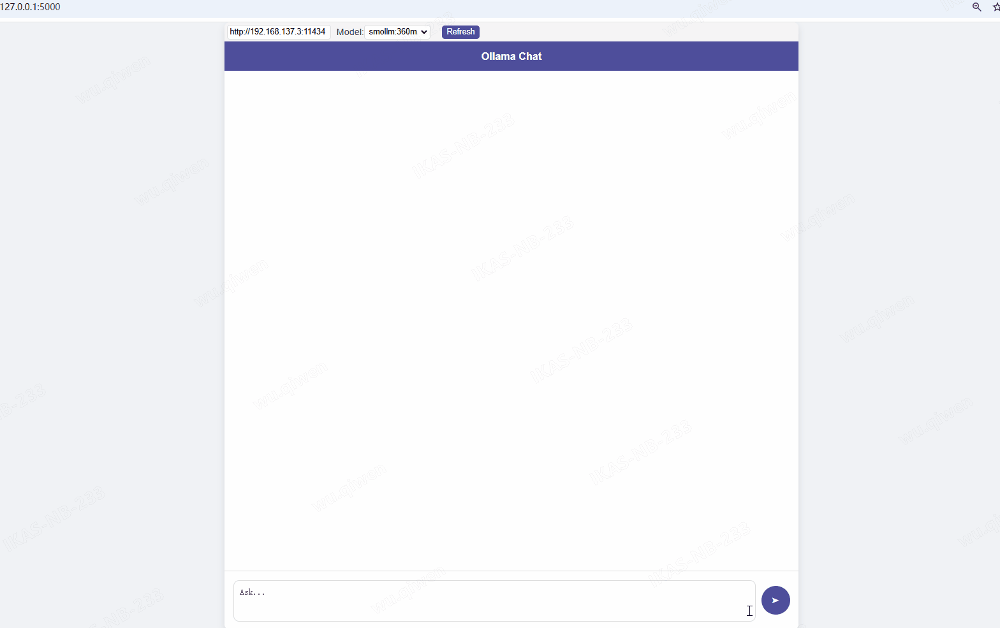

# OllamaSimpleChatWebUI
Simple Python Flask UI for Ollama




# 本项目技术栈为： 
- Python
- Flask
- Html

# 运行
- 1、安装依赖
```
pip install -r requirements.txt
```
- 2、运行
```
python main.py
```
- 3、访问
```
http://127.0.0.1:5000/
```


# 声明
- 本项目仅用作学习用途
- 本项目不会上传任何你的数据至任何第三方系统
- 如果发生任何回传行为，请检查是否为第三方修改版本
